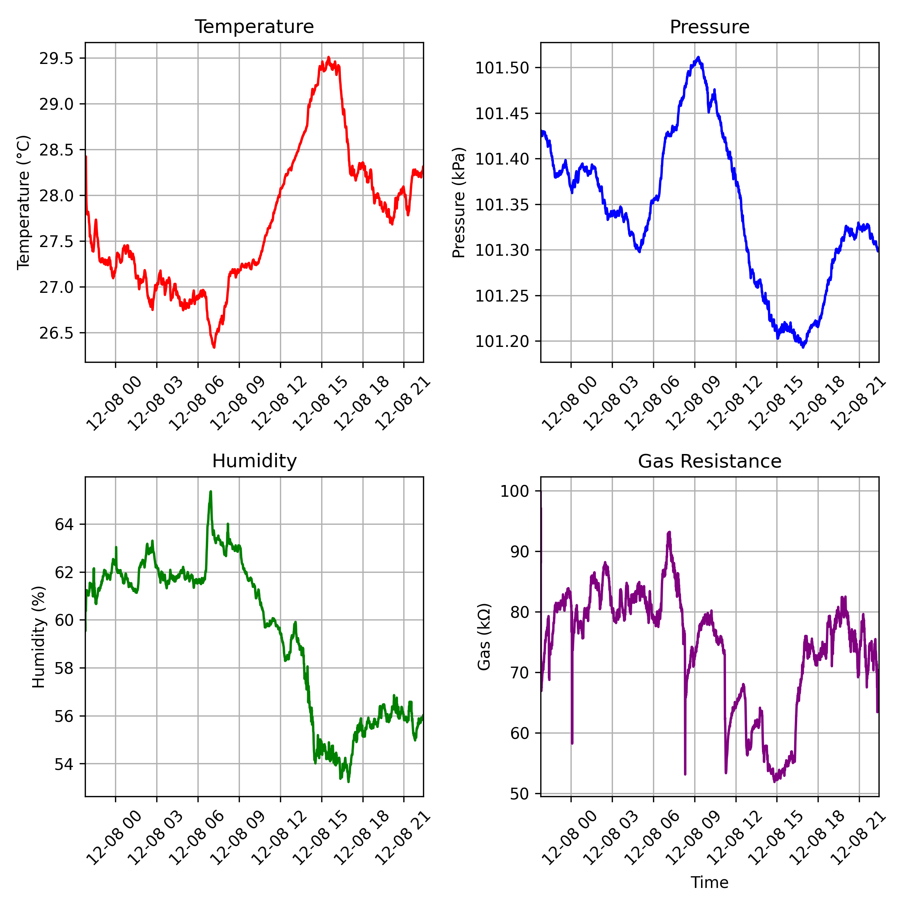

<h1>ESP-32 Home Environment Monitor</h1>

This project implements a custom low-level driver for the Bosch BME688 environmental sensor on an ESP-32-S3. Using this driver, I was able to collect temperature, humidity, pressure, and gas resistance measurements from my home environment. This data is then displayed in real-time on a 128x64 OLED screen (I2C driver provided by <a href="https://github.com/nopnop2002/esp-idf-ssd1306">nopnop2002</a>).

Below is a figure showing the collected sensor data over a 24-hour period.

<h3>Components used:</h3>
<ul>
<li>ESP-32 S3</li>
<li>BME688 Sensor</li>
<li>SSD1306 128x64 OLED</li>
</ul>
